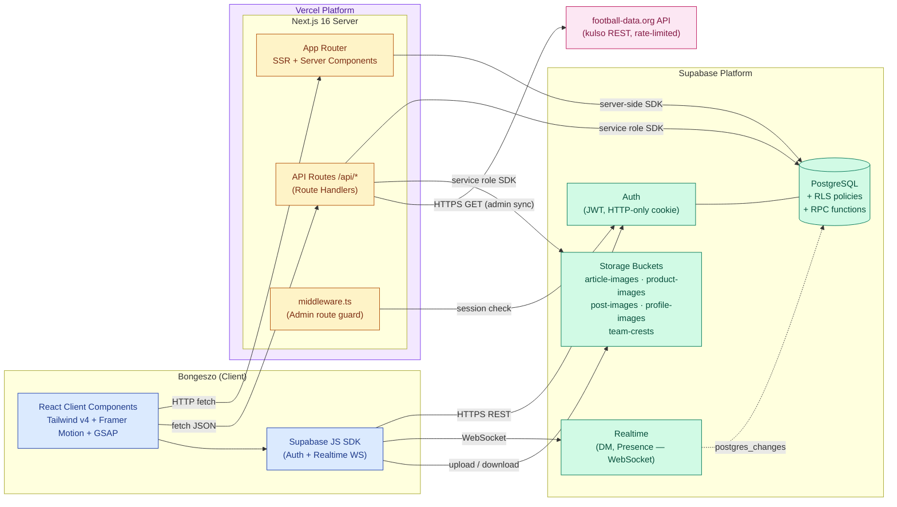

# Architektura diagram — Rendszer komponensek es kapcsolatok

```mermaid
flowchart LR
    subgraph Client["Bongeszo (Client)"]
        RCC["React Client Components<br/>Tailwind v4 + Framer Motion + GSAP"]
        SDK["Supabase JS SDK<br/>(Auth + Realtime WS)"]
    end

    subgraph Vercel["Vercel Platform"]
        subgraph NextServer["Next.js 16 Server"]
            APPR["App Router<br/>SSR + Server Components"]
            APIR["API Routes /api/*<br/>(Route Handlers)"]
            MW["middleware.ts<br/>(Admin route guard)"]
        end
    end

    subgraph Supabase["Supabase Platform"]
        AUTH["Auth<br/>(JWT, HTTP-only cookie)"]
        PG[("PostgreSQL<br/>+ RLS policies<br/>+ RPC functions")]
        STO["Storage Buckets<br/>article-images · product-images<br/>post-images · profile-images<br/>team-crests"]
        RT["Realtime<br/>(DM, Presence — WebSocket)"]
    end

    EXT["football-data.org API<br/>(kulso REST, rate-limited)"]

    RCC -->|"HTTP fetch"| APPR
    RCC -->|"fetch JSON"| APIR
    RCC --> SDK
    SDK -->|"HTTPS REST"| AUTH
    SDK -->|"WebSocket"| RT
    SDK -->|"upload / download"| STO

    APPR -->|"server-side SDK"| PG
    APIR -->|"service role SDK"| PG
    APIR -->|"service role SDK"| STO
    APIR -->|"HTTPS GET (admin sync)"| EXT
    MW -->|"session check"| AUTH

    RT -.->|"postgres_changes"| PG
    AUTH --- PG

    classDef client fill:#dbeafe,stroke:#1e40af,color:#1e3a8a
    classDef server fill:#fef3c7,stroke:#b45309,color:#7c2d12
    classDef vercel fill:#f3e8ff,stroke:#7c3aed,color:#4c1d95
    classDef supa fill:#d1fae5,stroke:#047857,color:#064e3b
    classDef ext fill:#fce7f3,stroke:#be185d,color:#831843

    class RCC,SDK client
    class APPR,APIR,MW server
    class Vercel vercel
    class AUTH,PG,STO,RT supa
    class EXT ext
```
