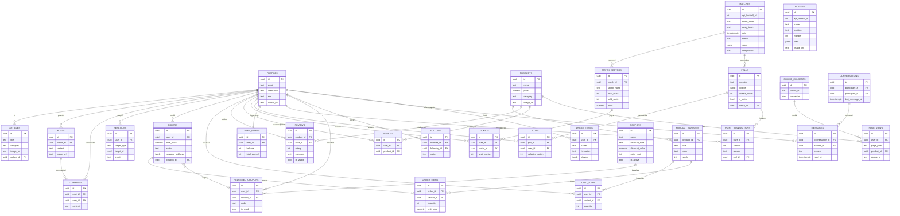

# ER Diagram — FC Barcelona Szurkolói Portál adatmodell

```mermaid
erDiagram
    %% ===== Felhasznalok =====
    PROFILES ||--o{ ARTICLES : "ir"
    PROFILES ||--o{ POSTS : "posztol"
    PROFILES ||--o{ COMMENTS : "kommentel"
    PROFILES ||--o{ REACTIONS : "reagal"
    PROFILES ||--o{ ORDERS : "rendel"
    PROFILES ||--o{ CART_ITEMS : "kosaraz"
    PROFILES ||--o{ REVIEWS : "ertekel"
    PROFILES ||--o{ WISHLIST : "kivansaglistaz"
    PROFILES ||--o{ TICKETS : "vasarol"
    PROFILES ||--o{ VOTES : "szavaz"
    PROFILES ||--|| USER_POINTS : "egyenlege"
    PROFILES ||--o{ POINT_TRANSACTIONS : "tranzakcioi"
    PROFILES ||--o{ REDEEMED_COUPONS : "bevaltott"
    PROFILES ||--o{ FOLLOWS : "kovet"
    PROFILES ||--o{ MESSAGES : "kuld"
    PROFILES ||--o{ DREAM_TEAMS : "alomcsapata"

    %% ===== Webshop =====
    PRODUCTS ||--o{ PRODUCT_VARIANTS : "valtozatai"
    PRODUCTS ||--o{ REVIEWS : "ertekelesei"
    PRODUCTS ||--o{ WISHLIST : "kivansagon"
    PRODUCT_VARIANTS ||--o{ CART_ITEMS : "kosarban"
    PRODUCT_VARIANTS ||--o{ ORDER_ITEMS : "tetelekben"
    ORDERS ||--|{ ORDER_ITEMS : "tartalmaz"
    ORDERS }o--o| REDEEMED_COUPONS : "kupon"

    %% ===== Meccs es jegy =====
    MATCHES ||--o{ MATCH_SECTORS : "szektorai"
    MATCHES ||--o{ POLLS : "meccshez"
    MATCH_SECTORS ||--o{ TICKETS : "jegyei"

    %% ===== Gamification =====
    POLLS ||--o{ VOTES : "szavazatai"
    POLLS ||--o{ POINT_TRANSACTIONS : "jutalom"
    COUPONS ||--o{ REDEEMED_COUPONS : "bevaltva"

    %% ===== Analitika =====
    PRODUCTS ||--o{ PAGE_VIEWS : "megtekintesei"
    COOKIE_CONSENTS ||--o{ PAGE_VIEWS : "cookie"

    %% ===== Kozosseg =====
    POSTS ||--o{ COMMENTS : "kommentjei"
    CONVERSATIONS ||--o{ MESSAGES : "uzenetei"

    PROFILES {
        uuid id PK
        text email
        text username
        text role
        text avatar_url
    }
    ARTICLES {
        uuid id PK
        text title
        text category
        text image_url
        uuid author_id FK
    }
    PLAYERS {
        uuid id PK
        int api_football_id
        text name
        text position
        int number
        jsonb stats
        text image_url
    }
    PRODUCTS {
        uuid id PK
        text name
        numeric price
        text category
        text image_url
    }
    PRODUCT_VARIANTS {
        uuid id PK
        uuid product_id FK
        text size
        text color
        int stock
    }
    CART_ITEMS {
        uuid id PK
        uuid user_id FK
        uuid variant_id FK
        int quantity
    }
    ORDERS {
        uuid id PK
        uuid user_id FK
        numeric total_price
        text status
        jsonb shipping_address
        uuid coupon_id FK
    }
    ORDER_ITEMS {
        uuid id PK
        uuid order_id FK
        uuid variant_id FK
        int quantity
        numeric unit_price
    }
    REVIEWS {
        uuid id PK
        uuid product_id FK
        uuid user_id FK
        int rating
        text comment
        bool is_visible
    }
    WISHLIST {
        uuid id PK
        uuid user_id FK
        uuid product_id FK
    }
    MATCHES {
        uuid id PK
        int api_football_id
        text home_team
        text away_team
        timestamptz date
        text status
        jsonb score
        text competition
    }
    MATCH_SECTORS {
        uuid id PK
        uuid match_id FK
        text sector_name
        int total_seats
        int sold_seats
        numeric price
    }
    TICKETS {
        uuid id PK
        uuid user_id FK
        uuid sector_id FK
        int seat_number
    }
    POSTS {
        uuid id PK
        uuid author_id FK
        text content
        text image_url
    }
    COMMENTS {
        uuid id PK
        uuid post_id FK
        uuid user_id FK
        text content
    }
    REACTIONS {
        uuid id PK
        uuid user_id FK
        text target_type
        uuid target_id
        text emoji
    }
    POLLS {
        uuid id PK
        text question
        jsonb options
        int correct_option
        bool is_active
        uuid match_id FK
    }
    VOTES {
        uuid id PK
        uuid poll_id FK
        uuid user_id FK
        int selected_option
    }
    USER_POINTS {
        uuid id PK
        uuid user_id FK
        int balance
        int total_earned
    }
    POINT_TRANSACTIONS {
        uuid id PK
        uuid user_id FK
        int amount
        text reason
        uuid poll_id FK
    }
    COUPONS {
        uuid id PK
        text name
        text discount_type
        numeric discount_value
        int point_cost
        bool is_active
    }
    REDEEMED_COUPONS {
        uuid id PK
        uuid user_id FK
        uuid coupon_id FK
        text code
        bool is_used
    }
    PAGE_VIEWS {
        uuid id PK
        uuid user_id FK
        text page_path
        uuid product_id FK
        text cookie_id
    }
    COOKIE_CONSENTS {
        uuid id PK
        text cookie_id
        bool consented
    }
    FOLLOWS {
        uuid id PK
        uuid follower_id FK
        uuid following_id FK
        text status
    }
    CONVERSATIONS {
        uuid id PK
        uuid participant_a FK
        uuid participant_b FK
        timestamptz last_message_at
    }
    MESSAGES {
        uuid id PK
        uuid conversation_id FK
        uuid sender_id FK
        text content
        timestamptz read_at
    }
    DREAM_TEAMS {
        uuid id PK
        uuid user_id FK
        text name
        text formation
        jsonb players
    }
```
