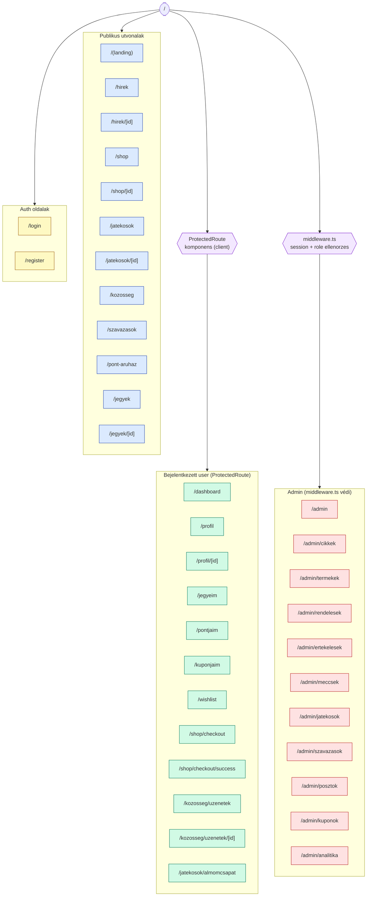

# Routing fa — Next.js App Router utvonalak

```mermaid
flowchart TD
    ROOT(["/"])

    subgraph Public["Publikus utvonalak"]
        P_LAND["/(landing)"]
        P_HIREK["/hirek"]
        P_HIREK_ID["/hirek/[id]"]
        P_SHOP["/shop"]
        P_SHOP_ID["/shop/[id]"]
        P_JAT["/jatekosok"]
        P_JAT_ID["/jatekosok/[id]"]
        P_KOZ["/kozosseg"]
        P_SZAV["/szavazasok"]
        P_PONT["/pont-aruhaz"]
        P_JEGY["/jegyek"]
        P_JEGY_ID["/jegyek/[id]"]
    end

    subgraph Auth["Auth oldalak"]
        A_LOGIN["/login"]
        A_REG["/register"]
    end

    subgraph User["Bejelentkezett user (ProtectedRoute)"]
        U_DASH["/dashboard"]
        U_PROF["/profil"]
        U_PROF_ID["/profil/[id]"]
        U_JEGY["/jegyeim"]
        U_PONT["/pontjaim"]
        U_KUP["/kuponjaim"]
        U_WISH["/wishlist"]
        U_CHK["/shop/checkout"]
        U_CHK_OK["/shop/checkout/success"]
        U_DM["/kozosseg/uzenetek"]
        U_DM_ID["/kozosseg/uzenetek/[id]"]
        U_ALOM["/jatekosok/almomcsapat"]
    end

    subgraph Admin["Admin (middleware.ts védi)"]
        AD_HOME["/admin"]
        AD_CIK["/admin/cikkek"]
        AD_TER["/admin/termekek"]
        AD_REND["/admin/rendelesek"]
        AD_ERT["/admin/ertekelesek"]
        AD_MEC["/admin/meccsek"]
        AD_JAT["/admin/jatekosok"]
        AD_SZA["/admin/szavazasok"]
        AD_POS["/admin/posztok"]
        AD_KUP["/admin/kuponok"]
        AD_ANA["/admin/analitika"]
    end

    MW{{"middleware.ts<br/>session + role ellenorzes"}}
    PR{{"ProtectedRoute<br/>komponens (client)"}}

    ROOT --> Public
    ROOT --> Auth
    ROOT --> PR
    ROOT --> MW

    PR --> User
    MW --> Admin

    classDef pub fill:#dbeafe,stroke:#1e40af
    classDef au fill:#fef9c3,stroke:#a16207
    classDef usr fill:#d1fae5,stroke:#047857
    classDef adm fill:#fee2e2,stroke:#b91c1c
    classDef guard fill:#f3e8ff,stroke:#7e22ce

    class P_LAND,P_HIREK,P_HIREK_ID,P_SHOP,P_SHOP_ID,P_JAT,P_JAT_ID,P_KOZ,P_SZAV,P_PONT,P_JEGY,P_JEGY_ID pub
    class A_LOGIN,A_REG au
    class U_DASH,U_PROF,U_PROF_ID,U_JEGY,U_PONT,U_KUP,U_WISH,U_CHK,U_CHK_OK,U_DM,U_DM_ID,U_ALOM usr
    class AD_HOME,AD_CIK,AD_TER,AD_REND,AD_ERT,AD_MEC,AD_JAT,AD_SZA,AD_POS,AD_KUP,AD_ANA adm
    class MW,PR guard
```
