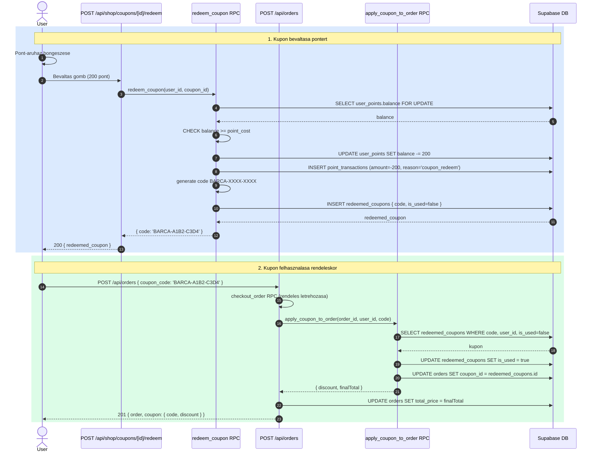

# Sequence diagram — Kupon bevaltas es felhasznalas

```mermaid
sequenceDiagram
    autonumber
    actor U as User
    participant RAPI as POST /api/shop/coupons/[id]/redeem
    participant RRPC as redeem_coupon RPC
    participant OAPI as POST /api/orders
    participant ARPC as apply_coupon_to_order RPC
    participant DB as Supabase DB

    rect rgb(219, 234, 254)
        Note over U,DB: 1. Kupon bevaltasa pontert
        U->>U: Pont-aruhaz bongeszese
        U->>RAPI: Bevaltas gomb (200 pont)
        RAPI->>RRPC: redeem_coupon(user_id, coupon_id)
        RRPC->>DB: SELECT user_points.balance FOR UPDATE
        DB-->>RRPC: balance
        RRPC->>RRPC: CHECK balance >= point_cost
        RRPC->>DB: UPDATE user_points SET balance -= 200
        RRPC->>DB: INSERT point_transactions (amount=-200, reason='coupon_redeem')
        RRPC->>RRPC: generate code BARCA-XXXX-XXXX
        RRPC->>DB: INSERT redeemed_coupons { code, is_used=false }
        DB-->>RRPC: redeemed_coupon
        RRPC-->>RAPI: { code: 'BARCA-A1B2-C3D4' }
        RAPI-->>U: 200 { redeemed_coupon }
    end

    rect rgb(220, 252, 231)
        Note over U,DB: 2. Kupon felhasznalasa rendeleskor
        U->>OAPI: POST /api/orders { coupon_code: 'BARCA-A1B2-C3D4' }
        OAPI->>OAPI: checkout_order RPC (rendeles letrehozasa)
        OAPI->>ARPC: apply_coupon_to_order(order_id, user_id, code)
        ARPC->>DB: SELECT redeemed_coupons WHERE code, user_id, is_used=false
        DB-->>ARPC: kupon
        ARPC->>DB: UPDATE redeemed_coupons SET is_used = true
        ARPC->>DB: UPDATE orders SET coupon_id = redeemed_coupons.id
        ARPC-->>OAPI: { discount, finalTotal }
        OAPI->>DB: UPDATE orders SET total_price = finalTotal
        OAPI-->>U: 201 { order, coupon: { code, discount } }
    end
```
