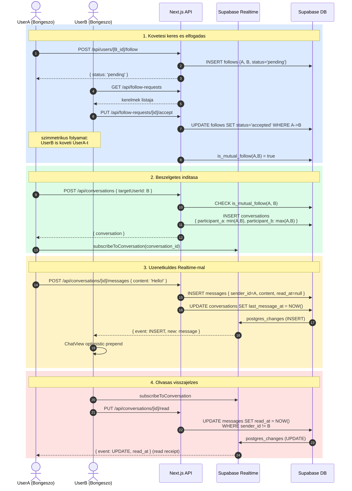

# Sequence diagram — Kovetes es DM flow

```mermaid
sequenceDiagram
    autonumber
    actor A as UserA (Bongeszo)
    actor B as UserB (Bongeszo)
    participant API as Next.js API
    participant RT as Supabase Realtime
    participant DB as Supabase DB

    rect rgb(219, 234, 254)
        Note over A,DB: 1. Kovetesi keres es elfogadas
        A->>API: POST /api/users/[B_id]/follow
        API->>DB: INSERT follows {A, B, status='pending'}
        API-->>A: { status: 'pending' }
        B->>API: GET /api/follow-requests
        API-->>B: kerelmek listaja
        B->>API: PUT /api/follow-requests/[id]/accept
        API->>DB: UPDATE follows SET status='accepted' WHERE A->B
        Note over A,B: szimmetrikus folyamat:<br/>UserB is koveti UserA-t
        API->>DB: is_mutual_follow(A,B) = true
    end

    rect rgb(220, 252, 231)
        Note over A,DB: 2. Beszelgetes inditasa
        A->>API: POST /api/conversations { targetUserId: B }
        API->>DB: CHECK is_mutual_follow(A, B)
        API->>DB: INSERT conversations<br/>{ participant_a: min(A,B), participant_b: max(A,B) }
        API-->>A: { conversation }
        A->>RT: subscribeToConversation(conversation_id)
    end

    rect rgb(254, 243, 199)
        Note over A,DB: 3. Uzenetkuldes Realtime-mal
        A->>API: POST /api/conversations/[id]/messages { content: 'Hello!' }
        API->>DB: INSERT messages { sender_id=A, content, read_at=null }
        API->>DB: UPDATE conversations SET last_message_at = NOW()
        DB->>RT: postgres_changes (INSERT)
        RT-->>B: { event: INSERT, new: message }
        B->>B: ChatView optimistic prepend
    end

    rect rgb(254, 226, 226)
        Note over A,DB: 4. Olvasas visszajelzes
        B->>RT: subscribeToConversation
        B->>API: PUT /api/conversations/[id]/read
        API->>DB: UPDATE messages SET read_at = NOW()<br/>WHERE sender_id != B
        DB->>RT: postgres_changes (UPDATE)
        RT-->>A: { event: UPDATE, read_at } (read receipt)
    end
```
