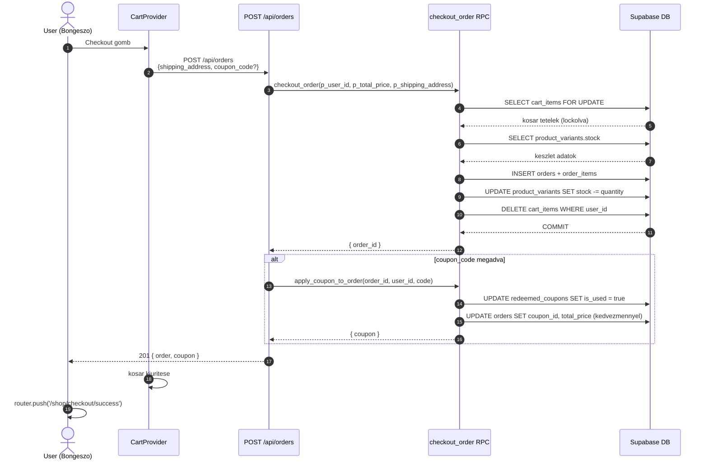

# Sequence diagram — Termek megrendeles

```mermaid
sequenceDiagram
    autonumber
    actor U as User (Bongeszo)
    participant CP as CartProvider
    participant API as POST /api/orders
    participant RPC as checkout_order RPC
    participant DB as Supabase DB

    U->>CP: Checkout gomb
    CP->>API: POST /api/orders<br/>{shipping_address, coupon_code?}
    API->>RPC: checkout_order(p_user_id, p_total_price, p_shipping_address)
    RPC->>DB: SELECT cart_items FOR UPDATE
    DB-->>RPC: kosar tetelek (lockolva)
    RPC->>DB: SELECT product_variants.stock
    DB-->>RPC: keszlet adatok
    RPC->>DB: INSERT orders + order_items
    RPC->>DB: UPDATE product_variants SET stock -= quantity
    RPC->>DB: DELETE cart_items WHERE user_id
    DB-->>RPC: COMMIT
    RPC-->>API: { order_id }

    alt coupon_code megadva
        API->>RPC: apply_coupon_to_order(order_id, user_id, code)
        RPC->>DB: UPDATE redeemed_coupons SET is_used = true
        RPC->>DB: UPDATE orders SET coupon_id, total_price (kedvezmennyel)
        RPC-->>API: { coupon }
    end

    API-->>U: 201 { order, coupon }
    CP->>CP: kosar kiuritese
    U->>U: router.push('/shop/checkout/success')
```
