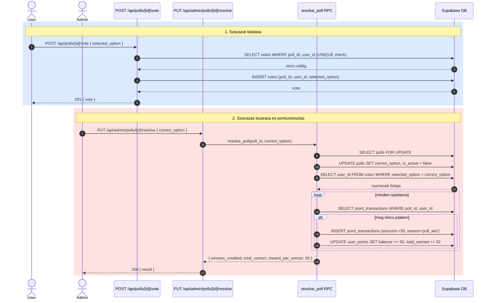

# Sequence diagram — Szavazat leadasa, lezaras es pontszetosztas

```mermaid
sequenceDiagram
    autonumber
    actor U as User
    actor A as Admin
    participant VAPI as POST /api/polls/[id]/vote
    participant RAPI as PUT /api/admin/polls/[id]/resolve
    participant RPC as resolve_poll RPC
    participant DB as Supabase DB

    rect rgb(219, 234, 254)
        Note over U,DB: 1. Szavazat leadasa
        U->>VAPI: POST /api/polls/[id]/vote { selected_option }
        VAPI->>DB: SELECT votes WHERE poll_id, user_id (UNIQUE check)
        DB-->>VAPI: nincs eddig
        VAPI->>DB: INSERT votes (poll_id, user_id, selected_option)
        DB-->>VAPI: vote
        VAPI-->>U: 201 { vote }
    end

    rect rgb(254, 226, 226)
        Note over A,DB: 2. Szavazas lezarasa es pontszetosztas
        A->>RAPI: PUT /api/admin/polls/[id]/resolve { correct_option }
        RAPI->>RPC: resolve_poll(poll_id, correct_option)
        RPC->>DB: SELECT polls FOR UPDATE
        RPC->>DB: UPDATE polls SET correct_option, is_active = false
        RPC->>DB: SELECT user_id FROM votes WHERE selected_option = correct_option
        DB-->>RPC: nyertesek listaja

        loop minden nyertesre
            RPC->>DB: SELECT point_transactions WHERE poll_id, user_id
            alt meg nincs jutalom
                RPC->>DB: INSERT point_transactions (amount=+50, reason='poll_win')
                RPC->>DB: UPDATE user_points SET balance += 50, total_earned += 50
            end
        end

        RPC-->>RAPI: { winners_credited, total_correct, reward_per_winner: 50 }
        RAPI-->>A: 200 { result }
    end
```
