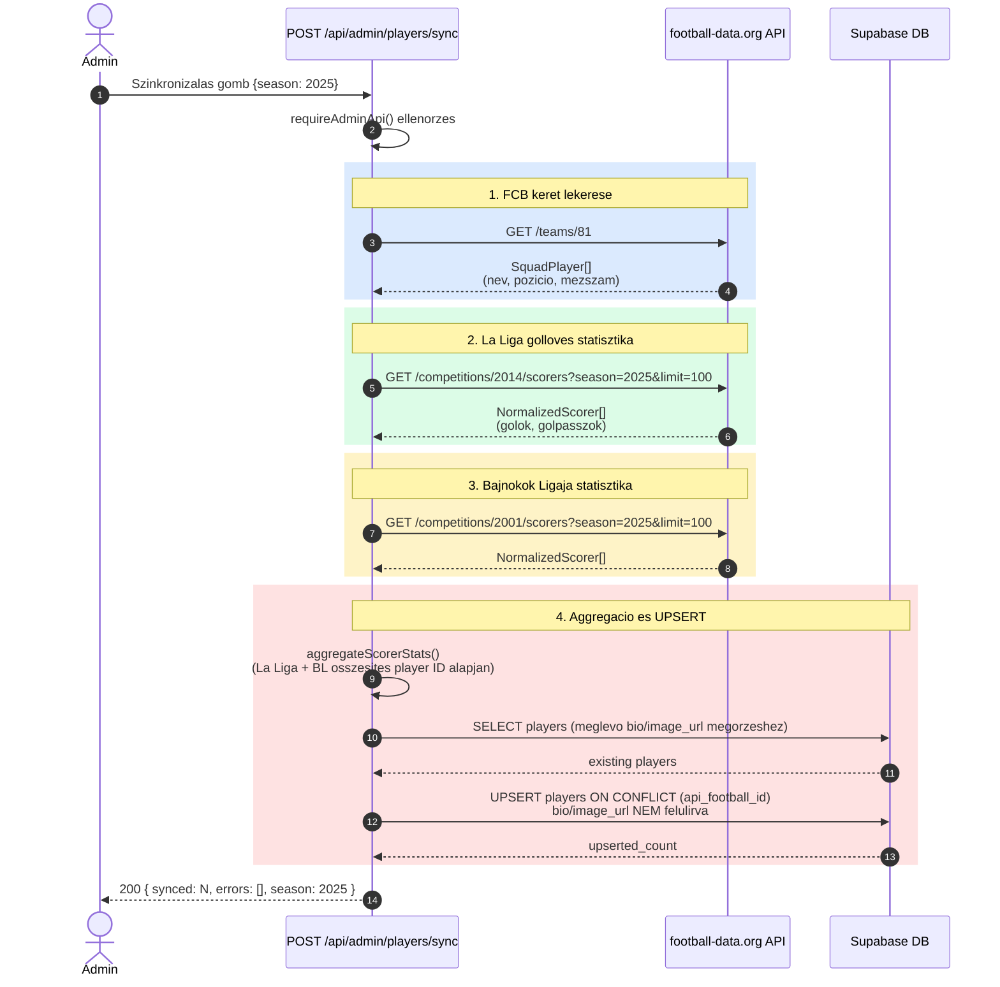

# Sequence diagram — Jatekos es meccs szinkronizacio (football-data.org)

```mermaid
sequenceDiagram
    autonumber
    actor AD as Admin
    participant API as POST /api/admin/players/sync
    participant FD as football-data.org API
    participant DB as Supabase DB

    AD->>API: Szinkronizalas gomb {season: 2025}
    API->>API: requireAdminApi() ellenorzes

    rect rgb(219, 234, 254)
        Note over API,FD: 1. FCB keret lekerese
        API->>FD: GET /teams/81
        FD-->>API: SquadPlayer[]<br/>(nev, pozicio, mezszam)
    end

    rect rgb(220, 252, 231)
        Note over API,FD: 2. La Liga golloves statisztika
        API->>FD: GET /competitions/2014/scorers?season=2025&limit=100
        FD-->>API: NormalizedScorer[]<br/>(golok, golpasszok)
    end

    rect rgb(254, 243, 199)
        Note over API,FD: 3. Bajnokok Ligaja statisztika
        API->>FD: GET /competitions/2001/scorers?season=2025&limit=100
        FD-->>API: NormalizedScorer[]
    end

    rect rgb(254, 226, 226)
        Note over API,DB: 4. Aggregacio es UPSERT
        API->>API: aggregateScorerStats()<br/>(La Liga + BL osszesites player ID alapjan)
        API->>DB: SELECT players (meglevo bio/image_url megorzeshez)
        DB-->>API: existing players
        API->>DB: UPSERT players ON CONFLICT (api_football_id)<br/>bio/image_url NEM felulirva
        DB-->>API: upserted_count
    end

    API-->>AD: 200 { synced: N, errors: [], season: 2025 }
```
