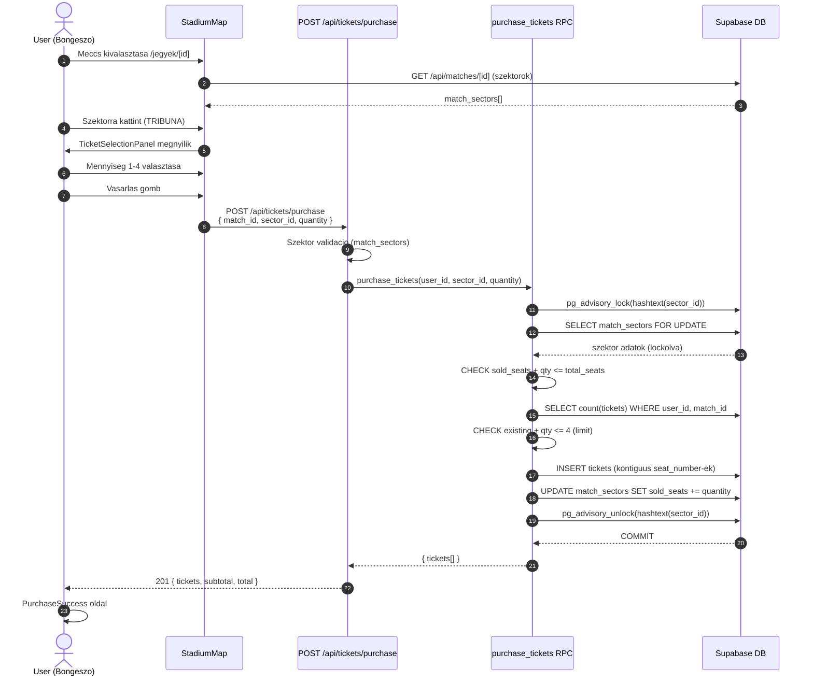

# Sequence diagram — Jegyvasarlas

```mermaid
sequenceDiagram
    autonumber
    actor U as User (Bongeszo)
    participant SM as StadiumMap
    participant API as POST /api/tickets/purchase
    participant RPC as purchase_tickets RPC
    participant DB as Supabase DB

    U->>SM: Meccs kivalasztasa /jegyek/[id]
    SM->>DB: GET /api/matches/[id] (szektorok)
    DB-->>SM: match_sectors[]
    U->>SM: Szektorra kattint (TRIBUNA)
    SM->>U: TicketSelectionPanel megnyilik
    U->>SM: Mennyiseg 1-4 valasztasa
    U->>SM: Vasarlas gomb
    SM->>API: POST /api/tickets/purchase<br/>{ match_id, sector_id, quantity }
    API->>API: Szektor validacio (match_sectors)
    API->>RPC: purchase_tickets(user_id, sector_id, quantity)
    RPC->>DB: pg_advisory_lock(hashtext(sector_id))
    RPC->>DB: SELECT match_sectors FOR UPDATE
    DB-->>RPC: szektor adatok (lockolva)
    RPC->>RPC: CHECK sold_seats + qty <= total_seats
    RPC->>DB: SELECT count(tickets) WHERE user_id, match_id
    RPC->>RPC: CHECK existing + qty <= 4 (limit)
    RPC->>DB: INSERT tickets (kontiguus seat_number-ek)
    RPC->>DB: UPDATE match_sectors SET sold_seats += quantity
    RPC->>DB: pg_advisory_unlock(hashtext(sector_id))
    DB-->>RPC: COMMIT
    RPC-->>API: { tickets[] }
    API-->>U: 201 { tickets, subtotal, total }
    U->>U: PurchaseSuccess oldal
```
